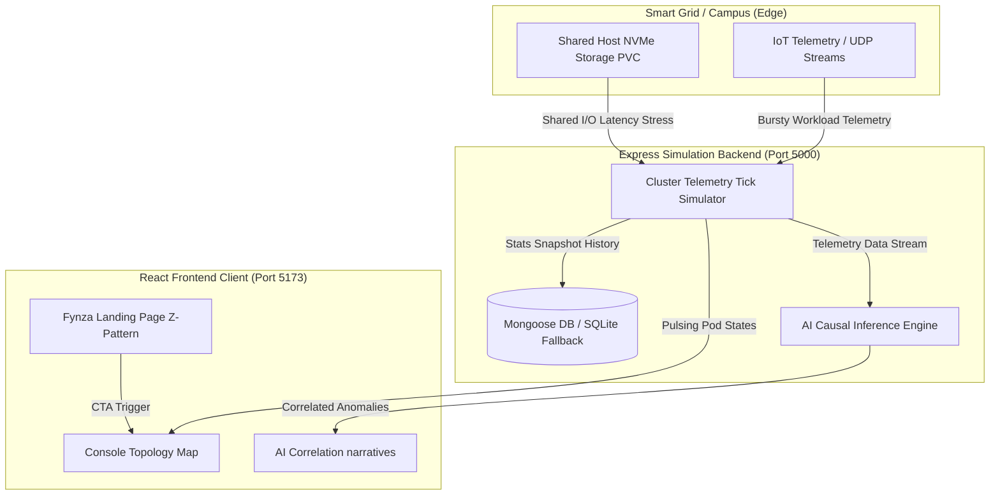

# KubePulse AI 🧠📡
### Next-Gen Edge Container Orchestration & AI Causal Correlation Platform

KubePulse AI is a real-time, lightweight, AI-driven correlation engine designed specifically for single-node edge and industrial environments (like K3s, MicroK8s, and single-node Kubernetes).

Built for the **ABB Hackathon 2026** to solve the problem of tracing anomalies, bursty workloads, PVC storage stress, and cascading service failures in Smart Campus & Smart Town deployments.

---

## 🚀 Key Visual Modules & Live Demo
*   **Fynza-Inspired Landing Page**: Premium Z-pattern problem-solution pitch grid, feature matrices, interactive metrics previews, and comparative analysis cards.
*   **Interactive Topology Console**: A real-time SVG cluster map representing active namespaces (`smart-campus-core`, `iot-smart-grid`, `water-management`), live pulsing container status loops, moving data packet streams, and interactive pod log details.
*   **Causal AI Correlation Panel**: A cognitive analysis terminal that maps the direct links between hardware physical storage (PVC write wait queues) and container status crash evictions.
*   **Stress Simulation Injector**: A dashboard control system permitting judges to inject synthetic workloads (Bursty IoT influx, PVC Storage Thrashing, analytics worker OOM Memory Leaks, auth thread saturation) and watch KubePulse heal and diagnose in real time.

---

## 🏗️ System Architecture



---

## 💻 Tech Stack
*   **Frontend**: React + Vite + Vanilla CSS & SVG animations + Lucide Icons.
*   **Backend**: Node.js + Express.js simulation engine & REST API.
*   **Database**: MongoDB via Mongoose with an automatic failover fallback to local `db_fallback.json` (ensuring error-free standalone local launches).

---

## 🛠️ Installation & Getting Started

### Prerequisites
*   Node.js (v16+)
*   npm

### Setup Instructions

1.  **Clone the Repository**:
    ```bash
    git clone https://github.com/SUDHAKARJ08/Next-Gen-Edge-AI-Correlation-For-Single-Node-K3s-Clusters.git
    cd Next-Gen-Edge-AI-Correlation-For-Single-Node-K3s-Clusters
    ```

2.  **Start the Backend Simulator**:
    ```bash
    cd backend
    npm install
    npm start
    ```
    *Backend will listen on: `http://localhost:5000`*

3.  **Start the React Frontend**:
    Open a new terminal window:
    ```bash
    cd frontend
    npm install
    npm run dev
    ```
    *Frontend dev server will launch on: `http://localhost:5173`*

4.  **Open in Browser**:
    Navigate to **`http://localhost:5173`** to access the live dashboard!

---

## 💡 The Pitch Story: How to Demo during the Presentation
Refer to the comprehensive presentation script in our [walkthrough guide](walkthrough.md) for a step-by-step narration outline. Key beats:
1.  **The Hook**: Explain the problem of single-node shared PVC bottlenecks.
2.  **The Live Console**: Open the live dashboard topology.
3.  **The Climax**: Select "PVC Storage Thrashing" and watch `pump-controller` crash reboot.
4.  **The AI Resolution**: Highlight the KubePulse AI drawer pinpointing the root-cause NVMe block delay (38.4ms) rather than code bugs, saving developers days of manual triage.
